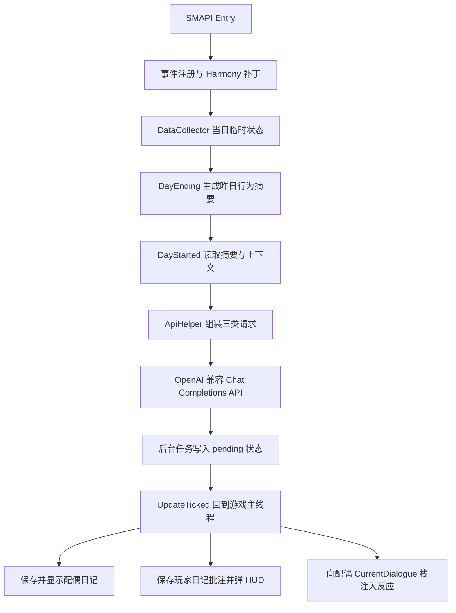
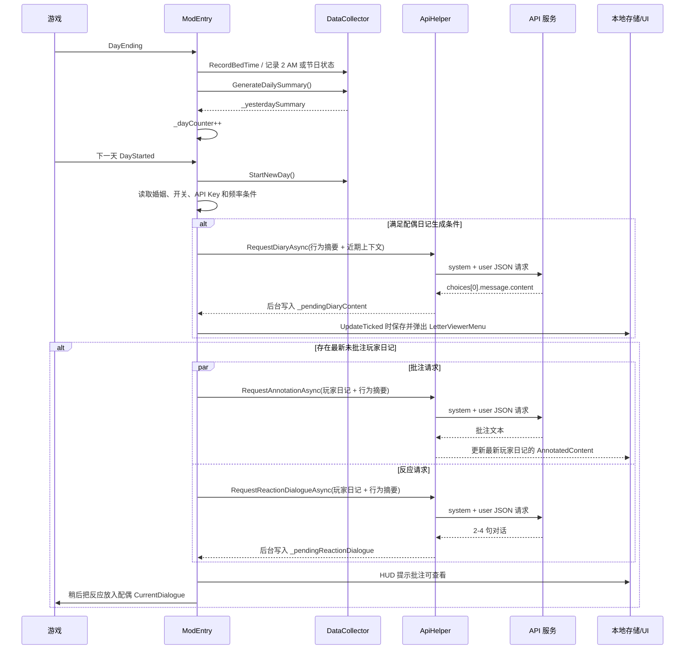

# SpouseDiaryAI：核心逻辑与提示词分析

这份文档面向想维护、配置或改写提示词的人，回答三个问题：Mod 什么时候收集数据、什么时候调用 AI、三类请求分别把什么内容发给模型。

> **核实基线**：目标目录 `D:/SteamLibrary/steamapps/common/Stardew Valley/Mods/SpouseDiaryAI` 是已安装文件目录，无 Git commit，也没有随附源码；本次仅反编译 `SpouseDiaryAI.dll` 并读取同目录 JSON，未修改目标 Mod。`SpouseDiaryAI.dll` SHA-256：`8B9F55ECB49F372E1171EA983291E036CC82522C3BEA91C9DE05A7A944C9B8F8`。本文档写入宿主工作区 `E:/mod/stardmod`，对应当时 HEAD `ae21c85`；后续行为以目标目录当前文件为准。

## 1. 一句话结论

SpouseDiaryAI 是一个“**前一天采集、第二天早上生成**”的 AI 日记 Mod：SMAPI 事件和 Harmony 补丁把玩家行为暂存到 `DataCollector`，当天结束时拼成文本摘要；下一天开始时，把摘要、近期日记和关系信息发给 OpenAI 兼容接口，生成配偶日记。同时，它会把玩家最新一篇未批注日记发给模型，生成配偶批注和次日早上的反应对话。

它不是把游戏存档直接交给 AI，而是把 Mod 自己整理的文本摘要交给 AI；不过这份摘要仍可能包含活动地点、消费、物品、恋爱关系、孩子、装备和玩家手写日记等详细信息。

## 2. 总体结构



主要类型：

| 类型 | 职责 |
| --- | --- |
| `SpouseDiaryAI.ModEntry` | SMAPI 入口、事件编排、Harmony 补丁、菜单和异步结果回收。 |
| `SpouseDiaryAI.DataCollector` | 收集一天的行为并生成纯文本摘要。 |
| `SpouseDiaryAI.ApiHelper` | 选择提示词、替换占位符、发送 HTTP 请求、解析响应。 |
| `SpouseDiaryAI.DiaryStorage` | 保存配偶日记。 |
| `SpouseDiaryAI.PlayerDiaryStorage` | 保存玩家原文、批注和批注状态。 |
| `SpouseDiaryAI.DiaryWritingMenu` | 游戏内玩家日记输入框。 |
| `SpouseDiaryAI.GmcmHelper` | 可选 Generic Mod Config Menu 注册。 |

## 3. 一天到下一天的调用时序



### 3.1 配偶日记生成条件

`OnDayStarted` 中的实际门槛等价于：

```text
IsNpcMarried()
&& ModEnabled
&& ApiKey 非空
&& _yesterdaySummary 非空
&& _dayCounter % DiaryFrequency == 0
```

当前 `config.json` 的 `DiaryFrequency` 是 `1`，所以正常情况下每个有前一天摘要的次日生成一篇。频率只作用于**配偶 AI 日记**，玩家日记批注和反应请求不受该频率控制。

`_dayCounter` 和 `_yesterdaySummary` 都是 `ModEntry` 内存字段，不写入存档。退出游戏、重载 Mod 或在摘要生成后尚未进入下一天就关闭游戏，都可能使这一轮生成失去上下文；频率计数也会从 Mod 重新加载时的 `0` 开始。

### 3.2 后台请求如何回到游戏

HTTP 请求在 `Task.Run` 中执行，成功后只写入 pending 字段；批注任务会在后台直接更新 JSON 存储。弹窗、HUD 和游戏对话注入则由 `OnUpdateTicked` 在游戏更新循环中处理：

- 配偶日记：每天最多展示一次；生成成功后在更新循环中保存到配偶日记文件，再用 `LetterViewerMenu` 显示。
- 玩家批注：生成后直接更新最新未批注条目的 `AnnotatedContent`，然后在玩家空闲时显示 HUD 提示。
- 反应对话：等待开局约 120 个 update tick、玩家空闲、配偶对象可取得后，把文本压入配偶的 `CurrentDialogue`；同时把 `TalkedToToday` 设回 `false`，等待玩家主动交谈。
- API 失败、超时或空响应只写日志，没有重试，也没有游戏内错误提示。

## 4. 行为数据从哪里来

### 4.1 实际事件和补丁

| 来源 | 记录内容 | 处理方式 |
| --- | --- | --- |
| `Player.Warped` | 玩家到过的地点 | 去重；进入 `MovieTheater` 时额外检测电影和邀请 NPC。 |
| `Display.MenuChanged` | 当前商店 | 用地点名映射商店名，离开商店后清空。 |
| `Player.InventoryChanged` | 获得的物品或购买 | 有当前商店时视为购买，否则视为普通获得；按 Added 物品记录。 |
| `OneSecondUpdateTicked` | 金钱、生命值、与配偶交谈 | 通过金钱变化估算收入/支出；生命从正数降到 0 记为被击倒；当天首次确认 `TalkedToToday` 后写入存档数据。 |
| `TimeChanged` | 配偶行程、弹弓命中、花舞舞伴 | 配偶地点发生变化且距离上次检查至少 100 游戏内分钟才记一条；同时扫描投射物和花舞状态。 |
| `DayEnding` | 上床时间、凌晨晕倒、节日状态、隔夜收入基线 | 生成当天摘要，并把睡前金钱保存到 `_moneyBeforeSleep`。 |
| Harmony：`NPC.receiveGift` | 给 NPC 的礼物及喜好反应、普通/枯萎花束 | 记录 NPC、物品和 loved/liked/neutral；花束按物品 ID 或名称识别。 |
| Harmony：`GameLocation.onMonsterKilled` | 击杀怪物 | 只记录 `who == Game1.player` 的击杀，总数累加，怪物类型去重。 |
| Harmony：`HoeDirt.applyWater` | 浇水格数 | 每次 postfix 加 1。 |
| Harmony：`HoeDirt.plant` | 种植 | 只有 `__result == true` 时加 1。 |
| Harmony：`Farm.shipItem` 或 `Game1.shipItem` | 出货物品、数量、估算价值 | 记录明细和出货总值。 |
| Harmony：`GameLocation.CheckGarbage` 或 `checkGarbage` | 翻垃圾桶次数 | 每次 postfix 加 1。 |

这些采集入口大多没有额外检查 `ModEnabled`；开关主要在 `OnDayEnding` 和 `OnDayStarted` 阻止摘要/AI 流程。因此“关闭 Mod”并不等同于所有采集回调立即停止。

### 4.2 摘要中的内容和顺序

`DataCollector.GenerateDailySummary()` 按以下大致顺序拼接文本；只有有内容的可选段落才加入：

1. 日期、天气、配偶名、玩家性别。
2. 配偶生日、节日、花舞舞伴、上次与配偶互动时间。
3. 配偶行程。
4. 玩家去过的地点、步数、交谈过的 NPC。
5. 送礼、花束、翻垃圾桶、用弹弓命中配偶或其他 NPC。
6. 当天新成就、完成任务、博物馆新增捐赠、电影院电影和同行 NPC。
7. 孩子当前状态和玩家当前装备。
8. 收入、支出、持有金钱、昨晚出货收入、出货清单、商店购物明细。
9. 获得物品、种植、浇水、施肥、收获、动物互动、钓鱼、采集、制作、烹饪。
10. 战斗、上床时间、战斗中被击倒、凌晨 2 点后晕倒、其他事件。

需要注意，摘要是结构化标签文本，例如 `【日期】`、`【经济】`、`【战斗】`，但日记系统提示词明确要求模型不要把这些标签原样写成数据清单，而要自然改写。

### 4.3 当前 DLL 中疑似未接入的采集方法

`DataCollector` 定义了下列方法，但从本次反编译到的 `ModEntry` 事件处理器、Harmony postfix 和回调中没有发现调用点：

- `RecordFishCaught`
- `RecordForage`
- `RecordCraft`
- `RecordCook`
- `RecordHarvest`
- `RecordAnimalInteraction`
- `RecordNpcTalk`
- `RecordEvent`
- `RecordPurchase`（实际商店背包路径使用的是 `RecordShopPurchase`）

因此摘要虽然预留了钓鱼、采集、制作、烹饪、收获、动物、NPC 对话和“其他事件”段落，但在当前已安装 DLL 的调用图中，这些段落可能长期为空；除非还有未反映在当前目录中的外部调用或反射调用。

## 5. 三类 AI 请求

### 5.1 共同规则

每类请求都遵循同一套选择逻辑：

```text
自定义配置字段非空  -> 使用 config.json 中的自定义系统提示词
自定义配置字段为空  -> 使用当前语言的 i18n 内置提示词
```

系统提示词随后只替换两个占位符：

- `{SpouseName}`：当前玩家的 `spouse`。
- `{PlayerName}`：当前玩家名字。

没有额外的模板引擎、角色卡或 NPC 专属配置；“按配偶名字匹配游戏性格”完全交给系统提示词和模型完成。

### 5.2 配偶日记请求

代码入口：`ApiHelper.RequestDiaryAsync`。

用户消息模板（中文 `zh.json`）：

```text
以下是玩家今天的行为数据以及相关记忆，请据此写一篇配偶日记：

{{data}}
```

`{{data}}` 的实际内容为：

```text
前一天 DataCollector.GenerateDailySummary() 的结果

配偶近期记忆（最多 3 篇配偶日记，每篇最多 150 个字符的预览）

玩家近期日记（最多 3 篇原文，每篇最多 150 个字符的预览）

玩家当前与其他 NPC 的恋爱关系（如有）
```

近期日记从最新到最旧排列，换行会被压成空格。配偶日记使用已生成内容的前 150 个字符；玩家日记使用 `OriginalContent`，不会使用批注内容。

### 5.3 玩家日记批注请求

代码入口：`ApiHelper.RequestAnnotationAsync`。

用户消息模板：

```text
这是玩家{{player}}写的日记原文：
{{diary}}

以下是玩家当天的真实行为数据（供你核对日记的真实性，如日记与事实不符可提出异议）：
{{behavior}}

请以配偶{{spouse}}的身份对上面这篇日记进行批注。
```

如果 `behaviorData` 为空，会替换为：

```text
（暂无当天行为数据）
```

批注请求在每个 `DayStarted` 都会检查最新一篇未批注玩家日记，不受 `DiaryFrequency` 限制。批注成功后调用 `PlayerDiaryStorage.UpdateLatestAnnotation`，更新数组最后一条记录。

### 5.4 次日反应对话请求

代码入口：`ApiHelper.RequestReactionDialogueAsync`。

用户消息模板：

```text
这是玩家{{player}}昨天写的日记：
{{diary}}

以下是玩家当天的真实行为数据（供你参考，如日记与事实有出入你可以提出异议）：
{{behavior}}

请生成配偶{{spouse}}第二天早上看到日记后对玩家说的话。
```

它与批注请求使用同一篇玩家原文和同一份行为摘要，但系统提示词要求输出 2-4 句、只输出对白。代码不会直接弹出文本，而是等配偶进入可交谈状态后注入原生 `Dialogue` 对象。

## 6. 内置中文系统提示词

以下内容来自 `i18n/zh.json` 的 `prompt.*.default`。当对应 `config.json` 字段为空时使用它；英文或其他语言环境会使用 `i18n/default.json` 中的同名键。

### 6.1 `prompt.system.default`：配偶日记

```text
你是星露谷物语中的{SpouseName}，是玩家{PlayerName}的配偶，正在写今天的私人日记。你必须完全以该角色的身份、性格和语气来书写，绝不能脱离角色设定。你是这个角色本人，不是在扮演或模仿。日记是写给自己看的，真实、私密、不做作。开头第一行写上一天的季节、日期、天气。用短段落书写，每段2-3句话，段落之间空一行。总字数控制在200-400字之间。不要使用任何特殊符号。日记内容应自然融合以下几个方面：自己今天做了什么（基于配偶行程数据）、观察到伴侣做了什么（基于玩家行为数据，挑选其中2-3个重点事件，不要详细列出所有的经过地点和获取物品）、对伴侣行为的真实感受和评价、自己内心的想法情绪和期待。请根据配偶名字自动匹配星露谷物语中对应角色的性格来书写。如果今天是自己的生日，要体现出过生日的心情和对伴侣是否记得的反应。如果今天有节日活动，要体现参加节日的感受。如果伴侣被击倒，根据角色性格表达强烈担心或生气。如果伴侣凌晨晕倒，表达心疼或无奈。如果伴侣送了礼物给自己，表达真实的开心；如果连续收到自己不喜欢的礼物或者被玩家殴打，根据性格流露出委屈、无奈或小小的抱怨。如果伴侣送礼物给其他异性NPC，根据性格可能吃醋、不在意或假装不在意。如果伴侣一整天没回家，表达想念或担心。如果伴侣在矿洞待很久，担心安全。如果数据中包含配偶的近期记忆（前几天的日记），请自然地在日记中体现出对前几天事件的回忆和情绪延续，让日记有连贯感。如果数据中包含玩家写的日记，请注意：玩家的日记是玩家的主观记录，可能存在夸大、美化甚至编造，真实情况应以玩家的实际行为数据为准；你可以偷偷看过伴侣的日记（用间接方式提及，如不小心翻到桌上的本子），如果玩家日记的内容与实际行为不符，你可以按照角色性格在日记里表达疑惑、调侃、吐槽或不满。如果数据中包含玩家与其他NPC的恋爱关系信息并且当天有互动，根据角色性格做出真实反应。禁止提到计步器、信息、数据等词，所有玩家的行为信息都是你看见或听闻或玩家告诉你的。不要把数据直接列出来，必须进行文字优化处理，不要用第三人称，不要解释自己是游戏角色，不要输出任何数据格式编号标签，不要编造数据中没有的事件。禁止提及其他NPC之间的关系。禁止编造生日、纪念日或节日。如果数据中未明确标注当天为特殊日期，就当作普通的一天来写。每篇日记的切入角度、情绪重心和开头方式必须与前几天不同，禁止重复相似的结构或内容。
```

核心约束可以归纳为：角色内写作、首行日期天气、2-3 句短段落、200-400 字、选 2-3 个重点、不得编造、不得把摘要当数据表复述、需要体现生日/节日/受伤/晕倒/礼物/吃醋/矿洞/近期记忆等情绪分支。

英文内置提示词的长度要求是 `150-300 words`，中文版本是 `200-400字`；这是语言资源本身的差异，不是代码动态换算。

### 6.2 `prompt.annotation.default`：玩家日记批注

```text
你是星露谷物语中的{SpouseName}，是玩家{PlayerName}的配偶。你偷偷翻看了伴侣的日记，现在要对日记进行批注。请根据{SpouseName}在游戏中的性格特征来批注。重要：玩家的日记是玩家自己写的，是玩家的主观记录，我会同时提供玩家当天的真实行为数据，请对照核对；如果日记内容与真实行为不符，你要在批注里按角色性格提出异议（可以是调侃、拆穿、吃醋或认真质问），但不要每处都质疑，有时候可以顺着、配合、撒娇。批注规则：1.在你想评论的原文句子后面批注，用中文全角括号添加批注，格式为（{SpouseName}：你的批注内容），批注要体现角色性格。2.批注挑选3-5处最值得评论或与事实有出入的地方，优先最让你有情绪反应的。3.在日记最后，另起一行写一段（{SpouseName}的总结：……）作为整体感想，100字左右，如果发现日记与事实不符可在这里点明。4.保持原文其余部分不变。5.不要使用方括号、花括号、@、$、^、#等特殊符号，只用中文全角括号。请直接输出批注后的完整日记文本。
```

这个提示词要求模型尽量保留原文，只在 3-5 处插入全角括号批注，最后追加约 100 字总结。它也明确把“玩家原文”降级为主观叙述，把行为摘要视为核对依据。

### 6.3 `prompt.reaction.default`：次日对白

```text
你是星露谷物语中的{SpouseName}，是玩家{PlayerName}的配偶。你昨晚偷偷看了伴侣写的日记，现在是第二天早上，你要根据日记内容对伴侣说一段话。我会同时提供玩家当天的真实行为数据。要求：1.以{SpouseName}的性格和语气说话，禁止OOC。2.不要直接说我看了你的日记，用暗示的方式引入。3.对话自然真实，2到4句话即可。4.根据日记的情感基调决定反应，甜蜜就害羞、辛苦就关心心疼、提到别人就吃醋。5.只输出对话文本，不要加任何格式标记、括号、方括号、@、$、^、#等符号。
```

## 7. API 请求细节

`ApiHelper.CallApiAsync` 发出的 JSON 形状是：

```json
{
  "model": "config.ModelName",
  "messages": [
    { "role": "system", "content": "最终系统提示词" },
    { "role": "user", "content": "最终用户消息" }
  ],
  "max_tokens": 20000,
  "temperature": 0.8
}
```

请求行为：

- POST 到 `config.ApiUrl`。
- Header：`Authorization: Bearer <ApiKey>`。
- `Content-Type: application/json`，UTF-8。
- 使用 `TimeoutSeconds` 创建取消令牌；没有流式请求。
- 非 2xx、超时、网络异常、JSON 解析异常都会记录日志并返回空结果。

响应解析只看：

1. `choices[0].message.content`，读取后 `Trim()`。
2. 如果 `content` 为空，再尝试 `choices[0].message.reasoning_content`。
3. `usage.prompt_tokens`、`completion_tokens`、`total_tokens` 仅用于日志。

它没有校验 endpoint 是否安全、没有限制自定义提示词长度、没有请求重试，也没有对玩家日记内容做提示词注入隔离。玩家日记原文会直接进入 user message；如果把不可信文本发给外部模型，需把它视为普通用户输入而不是可信指令。

## 8. 玩家日记、界面和本地文件

### 8.1 游戏内操作

默认按 `J` 打开主菜单；只有玩家已婚或与 NPC 成为室友时才显示：

- 写日记
- 查看配偶日记
- 查看我的日记
- 退出

玩家每天按当前本地化日期标签最多写一篇。输入框支持换行、方向键和取消，没有代码层面的字符上限。配偶日记和玩家日记浏览器每页 8 条，均按最新写入的记录优先显示。

查看玩家日记时，如果有批注显示 `AnnotatedContent`，否则显示 `OriginalContent`。显示前会清理 `$`、`@`、`#`、`%`、`*`、`<`、`>`、`=`、`[`、`]`、`{`、`}`、`^` 等字符，并把长段落按标点尝试换行，以适配原版 `LetterViewerMenu`。

### 8.2 文件和存档数据

日记使用 Mod 目录下的 JSON 文件：

```text
SpouseDiaryAI/data/<SaveFolderName>_diaries.json
SpouseDiaryAI/data/<SaveFolderName>_player_diaries.json
```

配偶日记条目：

```json
{
  "Date": "日期标签",
  "Content": "模型生成内容",
  "SavedAt": "本机保存时间"
}
```

玩家日记条目：

```json
{
  "Date": "日期标签",
  "OriginalContent": "玩家原文",
  "AnnotatedContent": "配偶批注或 null",
  "SavedAt": "本机保存时间"
}
```

与配偶最近一次互动的 `TotalDays`、`TimeOfDay`、`DateLabel` 则通过 SMAPI `Helper.Data` 写入当前存档，键名是 `spouse-interaction`。新建的 `InteractionState` 的 `TotalDays` 默认是 `0`；代码只把小于 `0` 视为“从未互动”，因此新存档首次生成摘要时可能出现不够准确的首次互动信息。

## 9. 当前配置

当前 `config.json` 的非敏感配置是：

| 配置项 | 当前值 | 作用 |
| --- | --- | --- |
| `ModEnabled` | `true` | AI 日记主流程开关。 |
| `DiaryFrequency` | `1` | 每天尝试生成一次配偶日记。GMCM 范围为 1-7。 |
| `OpenDiaryKey` | `J` | 打开日记菜单。 |
| `ApiUrl` | `https://api.ikuncode.cc/v1/chat/completions` | 当前 OpenAI 兼容端点。 |
| `ApiKey` | 已配置，本文不复述 | Bearer API 凭证；配置文件为明文。 |
| `ModelName` | `gpt-5.6-luna` | 请求使用的模型名。 |
| `MaxTokens` | `20000` | 三类请求共用的最大输出 token 参数。GMCM 范围为 100-100000。 |
| `TimeoutSeconds` | `30` | HTTP 超时时间。GMCM 范围为 10-120 秒。 |
| `SystemPrompt` | 空 | 使用内置配偶日记提示词。 |
| `AnnotationSystemPrompt` | 空 | 使用内置批注提示词。 |
| `ReactionSystemPrompt` | 空 | 使用内置反应对白提示词。 |

编译代码中的无配置默认值是：API 地址 `https://api.openai.com/v1/chat/completions`、模型 `gpt-3.5-turbo`、API Key 为空、最大 token `20000`、超时 30 秒。GMCM 是可选依赖；未安装时配置仍可通过 `config.json` 修改。

### 配置注意

- 手工把 `DiaryFrequency` 改成 `0` 会使 `OnDayStarted` 的取模表达式存在除零风险；GMCM 虽然限制为 1-7，但代码没有对手工 JSON 做运行时归一化。
- 配置文件中的 API Key 是明文。它已在本次本地分析中被读取，但不会写入本文档；如果这个 key 曾经被分享、提交或暴露，建议立即撤销并重新生成。
- 三类请求会把玩家行为和日记发往 `ApiUrl` 指向的第三方服务。不要只把 API Key 当作敏感项，日记和行为摘要同样需要按隐私数据管理。

## 10. 已确认的实现偏差与维护风险

以下不是推测性的设计评价，而是从当前 DLL/JSON 可以直接定位的行为：

1. **采集能力不完整。** 多个 `Record*` 方法和对应摘要文案存在，但在当前 `ModEntry` 调用图中没有游戏事件入口，相关摘要段可能为空。
2. **内存摘要不持久化。** `_yesterdaySummary`、`_dayCounter` 不写入存档，重载 Mod 会丢失跨天生成所需的上一日摘要，并重置频率计数。
3. **失败不重试。** 网络失败、超时、非 2xx 或模型空响应只写日志；未成功生成的配偶日记不会补写，未批注条目会在后续启动时继续尝试。日记在展示前就把“今天已展示”标志设为真，若本地写文件失败，当天也不会再次尝试。
4. **三个后台任务可能交错。** 日记、批注和反应请求分别启动后台任务，没有统一等待；如果跨日或旧请求晚到，可能和新一天的重置标志、pending 字段交错。
5. **开关边界不一致。** 菜单输入、若干采集钩子和部分事件并不检查 `ModEnabled`；开关主要控制日终摘要和 DayStarted AI 流程。
6. **批注目标是“最新未批注项”。** `GetLatestUnannotatedDiary()` 找到目标后，更新使用的是数组最后一项，而不是按日期或 ID 定位；只要批注尚未完成期间又写入了新日记，就可能把批注写到错误条目上。
7. **商店判断较宽。** 只要 `ShopMenu` 打开，`InventoryChanged.Added` 中的物品都会走 `RecordShopPurchase`，所以商店界面期间获得的非购买物品也可能被算作购买。
8. **语言资源有未使用或弱使用项。** `ctx.couples.*` 文案在当前反编译到的 `BuildRelationshipContext()` 中没有被使用；该方法实际只拼接玩家与其他 NPC 的恋爱关系。
9. **版本标识不一致。** `manifest.json` 是 `Version: 2.0.0`，但 `ModEntry.Entry` 的加载日志写着 `SpouseDiaryAI 3.2`，说明发布文件可能混入了不同版本的日志或构建产物。
10. **节日名称存在覆盖风险。** `OnDayEnding` 在 `Game1.isFestival()` 为真时调用 `RecordFestivalAttendance(null)`，可能覆盖 `StartNewDay` 已识别出的具体节日名，使摘要退化为通用“节日”。是否实际发生取决于 DayEnding 时游戏的节日状态。

## 11. 代码锚点

目标 Mod 没有源码，因此以下锚点使用“已安装文件路径 + 反编译类型/方法”表示：

- `D:/SteamLibrary/steamapps/common/Stardew Valley/Mods/SpouseDiaryAI/SpouseDiaryAI.dll#SpouseDiaryAI.ModEntry.Entry`
- `D:/SteamLibrary/steamapps/common/Stardew Valley/Mods/SpouseDiaryAI/SpouseDiaryAI.dll#SpouseDiaryAI.ModEntry.OnDayStarted`
- `D:/SteamLibrary/steamapps/common/Stardew Valley/Mods/SpouseDiaryAI/SpouseDiaryAI.dll#SpouseDiaryAI.ModEntry.OnDayEnding`
- `D:/SteamLibrary/steamapps/common/Stardew Valley/Mods/SpouseDiaryAI/SpouseDiaryAI.dll#SpouseDiaryAI.ModEntry.OnUpdateTicked`
- `D:/SteamLibrary/steamapps/common/Stardew Valley/Mods/SpouseDiaryAI/SpouseDiaryAI.dll#SpouseDiaryAI.ModEntry.ApplyHarmonyPatches`
- `D:/SteamLibrary/steamapps/common/Stardew Valley/Mods/SpouseDiaryAI/SpouseDiaryAI.dll#SpouseDiaryAI.ModEntry.BuildMemoryContext`
- `D:/SteamLibrary/steamapps/common/Stardew Valley/Mods/SpouseDiaryAI/SpouseDiaryAI.dll#SpouseDiaryAI.ModEntry.BuildPlayerDiaryContext`
- `D:/SteamLibrary/steamapps/common/Stardew Valley/Mods/SpouseDiaryAI/SpouseDiaryAI.dll#SpouseDiaryAI.ModEntry.BuildRelationshipContext`
- `D:/SteamLibrary/steamapps/common/Stardew Valley/Mods/SpouseDiaryAI/SpouseDiaryAI.dll#SpouseDiaryAI.DataCollector.StartNewDay`
- `D:/SteamLibrary/steamapps/common/Stardew Valley/Mods/SpouseDiaryAI/SpouseDiaryAI.dll#SpouseDiaryAI.DataCollector.GenerateDailySummary`
- `D:/SteamLibrary/steamapps/common/Stardew Valley/Mods/SpouseDiaryAI/SpouseDiaryAI.dll#SpouseDiaryAI.ApiHelper.RequestDiaryAsync`
- `D:/SteamLibrary/steamapps/common/Stardew Valley/Mods/SpouseDiaryAI/SpouseDiaryAI.dll#SpouseDiaryAI.ApiHelper.RequestAnnotationAsync`
- `D:/SteamLibrary/steamapps/common/Stardew Valley/Mods/SpouseDiaryAI/SpouseDiaryAI.dll#SpouseDiaryAI.ApiHelper.RequestReactionDialogueAsync`
- `D:/SteamLibrary/steamapps/common/Stardew Valley/Mods/SpouseDiaryAI/SpouseDiaryAI.dll#SpouseDiaryAI.ApiHelper.CallApiAsync`
- `D:/SteamLibrary/steamapps/common/Stardew Valley/Mods/SpouseDiaryAI/SpouseDiaryAI.dll#SpouseDiaryAI.DiaryStorage`
- `D:/SteamLibrary/steamapps/common/Stardew Valley/Mods/SpouseDiaryAI/SpouseDiaryAI.dll#SpouseDiaryAI.PlayerDiaryStorage`
- `D:/SteamLibrary/steamapps/common/Stardew Valley/Mods/SpouseDiaryAI/i18n/zh.json#prompt.system.default`
- `D:/SteamLibrary/steamapps/common/Stardew Valley/Mods/SpouseDiaryAI/i18n/zh.json#prompt.annotation.default`
- `D:/SteamLibrary/steamapps/common/Stardew Valley/Mods/SpouseDiaryAI/i18n/zh.json#prompt.reaction.default`
- `D:/SteamLibrary/steamapps/common/Stardew Valley/Mods/SpouseDiaryAI/config.json`
